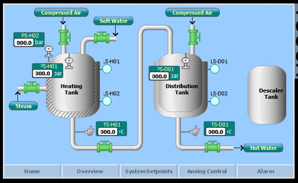
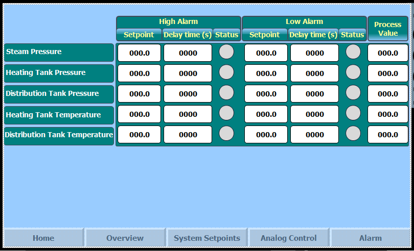
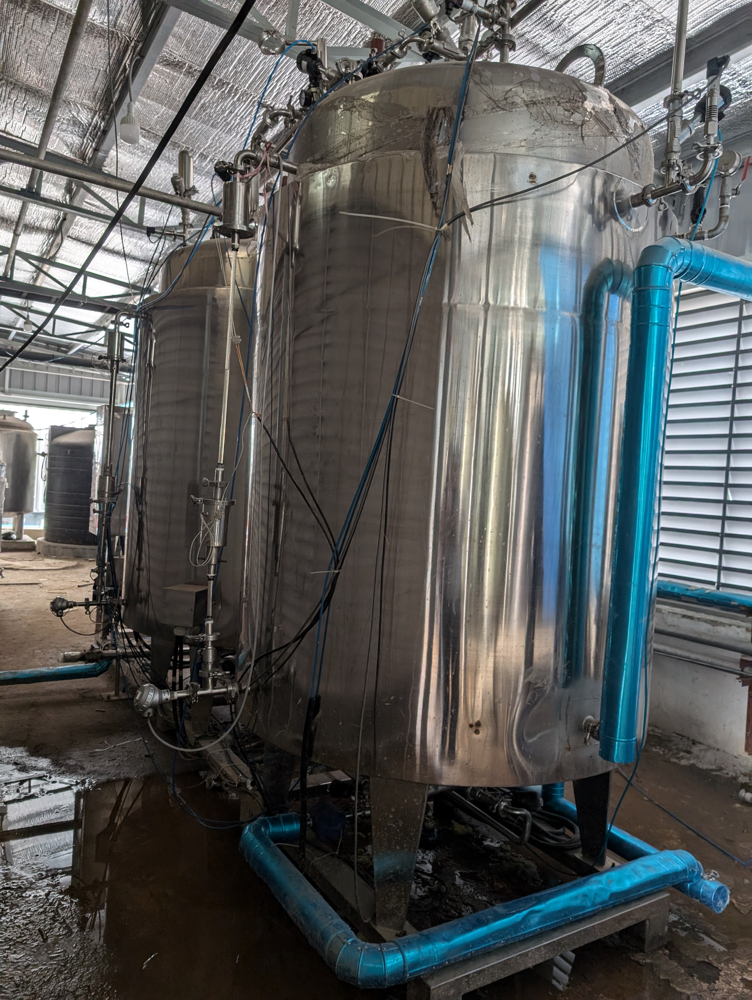
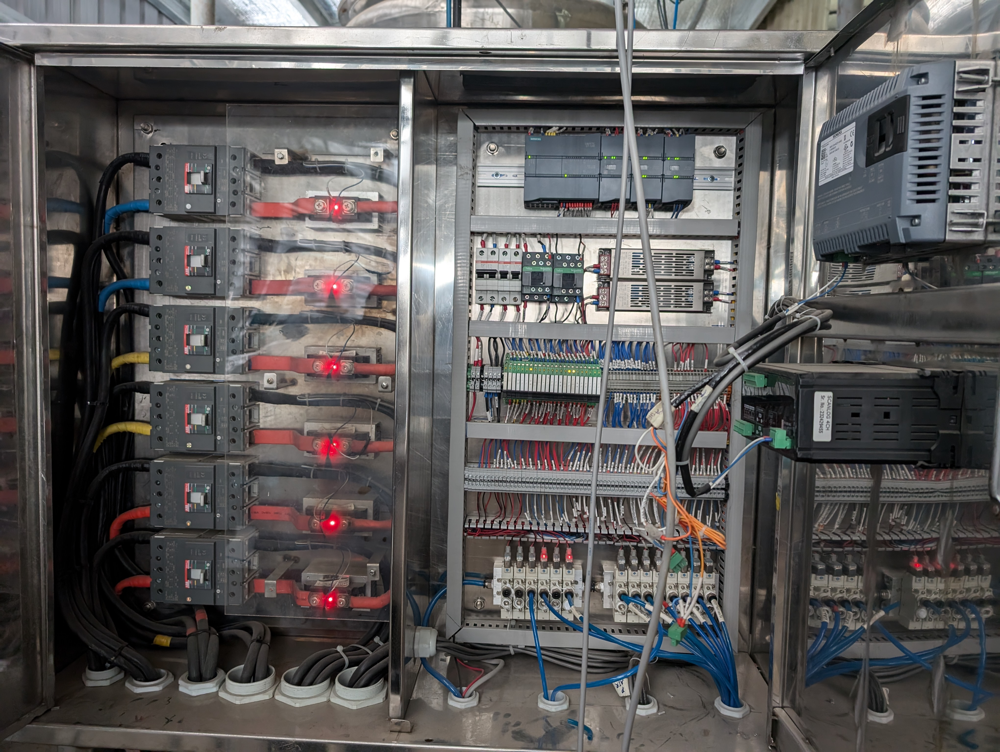

# Hot Water Generation Plant

**A two-stage hot water generation and distribution system that supplies continuous 80 °C water to production equipment and the bin washing station — steam-heated at the front, electrically trimmed at the back.**

Built for Renata PLC.

<p align="center">
  
  <em>The plant on one screen — steam-heated Heating Tank, electrically-held Distribution Tank, and the descaler circuit.</em>
</p>


**Role:** Sole developer, end to end

---

## Table of contents

- [What this plant does — in plain terms](#what-this-plant-does--in-plain-terms)
- [The engineering problem](#the-engineering-problem)
- [The two-tank strategy](#the-two-tank-strategy)
- [Process flow](#process-flow)
- [Instrumentation and final control elements](#instrumentation-and-final-control-elements)
- [Hardware](#hardware)
- [Control software design](#control-software-design)
- [Operator interface](#operator-interface)
- [The plant](#the-plant)
- [Repository contents](#repository-contents)
- [Opening the project](#opening-the-project)
- [Glossary for non-specialist readers](#glossary-for-non-specialist-readers)
- [Author](#author)

---

## What this plant does — in plain terms

Every time a batch of medicine finishes, the equipment that made it has to be cleaned before the
next batch can start — the mixers, the granulators, the transfer bins. That cleaning is done with
hot water, and in pharmaceutical manufacturing it happens under two named regimes: **WIP**
(washing in place) and **SIP** (sanitisation in place).

Both need the same thing: **hot water, at a known temperature, available the moment it is asked
for.**

That sounds trivial until you look at the demand pattern. Cleaning is bursty. Nothing draws water
for an hour, then a bin washing cycle starts and pulls a large volume at once. If the water is
20 °C too cool when that happens, the cleaning cycle is out of specification and the batch record
has a deviation in it. If the water is not there at all, production waits.

This plant exists to make sure the answer is always "yes, at temperature, now."

---

## The engineering problem

The obvious design is one big tank with a heater in it. It fails for a reason worth understanding.

| Approach | Why it does not work |
|---|---|
| **One steam-heated tank** | Steam is powerful and cheap for bulk heating, but it is coarse. A steam valve holding a tank at a precise delivery temperature hunts around the setpoint, and the delivered temperature swings with steam header pressure — which is set by the boiler and the rest of the factory, not by this plant. |
| **One electrically heated tank** | Electric heating is precise and fully controllable, but heating a large volume of cold water from ambient electrically is slow and expensive. Recovering from a big draw-off would take too long. |
| **One tank of either kind** | The same vessel would have to do bulk heating *and* hold a stable delivery temperature at the same time. Those two jobs fight each other: whenever the tank is recovering from a draw, the delivery temperature is moving. |

**The design splits the two jobs across two tanks**, and that split is the core idea of the plant.

---

## The two-tank strategy

```
   ┌────────────────────────────┐        ┌────────────────────────────┐
   │  TANK 1 — HEATING TANK     │        │  TANK 2 — DISTRIBUTION     │
   │  (steam jacketed)          │        │  (electric heater)         │
   ├────────────────────────────┤        ├────────────────────────────┤
   │  JOB: bulk heating         │        │  JOB: hold temperature     │
   │                            │        │       and deliver          │
   │  Soft water in             │        │                            │
   │  Steam raises it to the    │  ───▶  │  Receives already-hot      │
   │  preheat setpoint          │        │  water                     │
   │                            │        │                            │
   │  Cheap, powerful, coarse   │        │  Only has to make up       │
   │                            │        │  standing losses           │
   │                            │        │                            │
   │                            │        │  Precise, fine, stable     │
   └────────────────────────────┘        └────────────────────────────┘
              │                                        │
              │  TRANSFER — permitted only when:       │
              │  · Tank 1 has reached its setpoint     │
              │  · Tank 2 level is below its threshold │
              └────────────────────────────────────────┘
                                                       ▼
                                              Hot water at 80 °C
                                              to WIP / SIP and
                                              the bin washing station
```

**Tank 1 does the heavy lifting.** Soft water enters, and a steam jacket brings it up to the
preheat setpoint. Steam is the right tool here: it moves a lot of energy quickly and cheaply, and
the fact that its control is coarse does not matter, because nothing downstream is being served
from this tank.

**Tank 2 does the fine work.** It receives water that is already hot, so its electric heater is
only ever making up standing heat loss — a small, steady, easily-controlled load. That is what lets
it hold a stable delivery temperature, which is the number the cleaning cycle actually cares about.

**The transfer is conditional, not continuous.** Water moves from Tank 1 to Tank 2 only when
**both** conditions are true:

1. Tank 1 has reached its temperature setpoint, and
2. Tank 2's level has dropped below its threshold.

That second condition is what protects the delivery temperature. Transferring on level alone would
dump partly-heated water into the distribution tank and drag its temperature down at exactly the
moment production is drawing from it. Requiring Tank 1 to be up to temperature *first* means every
transfer arrives hot, and Tank 2 never has to recover from a cold shock.

**Tank 3 is the descaler tank**, with its own pump and heat exchanger — hot water and scale go
together, and a descaling circuit built into the plant is the difference between a system that
performs the same in year three as in year one.

---

## Process flow

```
  Steam ─▶ main valve ─▶ PRV ─▶ pressure sensor ─────┐
                                                      ▼
  Soft water ─▶ inlet valve ─────────────────▶ ┌─────────────┐
  Compressed air ─▶ regulator ─▶ 5 & 0.2 µm ─▶ │   TANK 1    │
  filter ─▶ vent filter + air SRV              │  HEATING    │  steam jacket
                                               │             │
                                               │ PS · TS     │
                                               │ LS-1 · LS-2 │
                                               └──────┬──────┘
                                                      │  hot water transfer valve
                                                      ▼
  Compressed air ─▶ regulator ─▶ 5 & 0.2 µm ─▶ ┌─────────────┐
  filter ─▶ vent filter + air SRV              │   TANK 2    │  electric heater
                                               │DISTRIBUTION │
                                               │ PS · TS     │
                                               │ LS-1 · LS-2 │
                                               └──────┬──────┘
                                                      │  distribution valve
                                                      ▼
                                            Hot water (80 °C) to
                                            WIP / SIP and bin washing

           ┌─────────────┐
           │   TANK 3    │──▶ pump ──▶ heat exchanger ──▶ descaling circuit
           │  DESCALER   │
           └─────────────┘
```

Both process tanks are jacketed, and both carry the same air set: a compressed-air main valve and
regulator, **5 µm and 0.2 µm filtration**, a vent filter and an air safety relief valve. The
0.2 micron stage is the significant one — it means the air blanketing and venting these tanks is
sterile-filtered, which is what stops the tank breathing airborne contamination in as its level
falls.

---

## Instrumentation and final control elements

| Tank | Instruments | Actuators |
|---|---|---|
| **Tank 1 — Heating** | Pressure sensor, temperature sensor, level sensor 1, level sensor 2, steam pressure sensor upstream | Steam main valve, soft water inlet valve, compressed air valve, hot water transfer valve, jacket inlet/outlet valves, drain |
| **Tank 2 — Distribution** | Pressure sensor, temperature sensor, level sensor 1, level sensor 2 | Electric heater, compressed air valve, distribution valve, jacket inlet/outlet valves, drain |
| **Tank 3 — Descaler** | — | Inlet valve, outlet valve, circulation pump, heat exchanger |

Steam side: main valve, pressure reducing valve, gauges before and after the regulator, safety
relief valve, steam pressure sensor and condensate drain.

---

## Hardware

| Element | Device |
|---|---|
| Controller | **SIMATIC S7-1200, CPU 1214C DC/DC/DC** with signal-module expansion |
| HMI | **SIMATIC TP700 Comfort** panel |
| Network | PROFINET |
| Heater switching | Solid-state switching for time-proportioned (pulse) heater control |
| Heater protection | Heater circuits individually protected by moulded-case circuit breakers |
| Enclosure | Stainless steel control panel, plant-mounted |

---

## Control software design

Developed in **TIA Portal V15.1**.

**Closed-loop control**

- **`PID_Compact` on the heating tank temperature**, modulating the steam valve, with self-tuning
  and configured control zone.
- **`PID_Compact` on the distribution tank temperature**, driving the electric heater as a
  **time-proportioned pulse** output rather than a simple on/off contactor — which is what makes
  a stable delivery temperature achievable with resistive heating.
- **Pressure valve controllers** on both tanks, holding tank pressure within band via the
  compressed-air valves, with configured tolerance and high-limit supervision.

**Sequencing and transfer logic**

- Conditional **hot water transfer** from Tank 1 to Tank 2, gated on Tank 1 setpoint reached
  **and** Tank 2 below its level threshold.
- **Fill-up timers** and **tank-empty detection with delay**, so a momentarily uncovered level
  probe does not trigger a spurious empty state.
- **Vent control** with a vent counter and a **critical-pressure vent reset**, so pressure is
  relieved automatically and repeated venting is visible rather than silent.
- Soft water inlet control on level.

**Limits, alarms and calibration**

- Configurable **high and low alarm setpoints with independent delay times** for steam pressure,
  heating tank pressure, distribution tank pressure, heating tank temperature and distribution
  tank temperature — delay times matter here because a pressure spike during a transfer is normal
  and an alarm on it is noise.
- A **critical temperature** setpoint held separately from the operating setpoints.
- **Per-sensor calibration offsets** applied in software, so a re-ranged or replaced transmitter is
  a settings change rather than a program change.
- Alarm window with operator acknowledgement.

**Operation**

- Full **Auto / Manual** duality with per-device manual switches and manual enable, so every valve
  and heater can be driven individually during commissioning and maintenance.
- Named-user login.

---

## Operator interface

<p align="center">
  
</p>

A TP700 Comfort panel with five screens: **Home**, **Overview** (the process mimic),
**System Setpoints**, **Analog Control** and **Alarm**.

The alarm configuration screen puts high and low setpoints, **delay times** and live status for
every supervised parameter in one grid, next to the current process value. Exposing the delay time
as a configurable field beside the setpoint is deliberate: on a plant with bursty demand, the
difference between a real fault and a transient is almost always *how long it lasted*, and that
judgement should be tunable by the people running the plant rather than buried in the program.

The process mimic shows both tanks with their live pressures, temperatures and level indications,
the steam and soft water inlets, the compressed air feeds and the transfer and distribution
valves — so the state of the whole plant, including which way water is currently moving, is
readable at a glance.

---

## The plant

| | |
|---|---|
|  |  |
| **The tanks** — jacketed stainless vessels with their instrument and valve sets, and the insulated hot water distribution pipework. | **Control panel** — S7-1200 with signal modules and terminal marshalling on the right, heater switchgear and moulded-case breakers on the left. |

---

## Repository contents

```
Hot-Water-Generation-Plant/
├── Hot Water Generation V.2 (29.01.2024).ap15_1   TIA Portal V15.1 project file
├── System/                                         TIA project system data
├── IM/HMI/C/0                                      Compiled TP700 Comfort runtime
├── XRef/                                           Cross-reference database
├── Documents/
│   └── P&ID.pdf                                    Piping & instrumentation diagram
└── Photos/
    ├── hot_water_scada_1.PNG                       Process mimic
    ├── hot_water_scada_2.PNG                       Alarm parameter screen
    ├── 1.jpg                                       The tanks
    └── 4.jpg                                       Control panel interior
```

The **P&ID** in `Documents/` is the authoritative reference for the plant: it carries the full
numbered equipment list — all three tanks, the steam set, both air sets, every valve, and the
descaler pump and heat exchanger.

---

## Opening the project

**Requirements**

- Siemens **TIA Portal V15.1** with STEP 7 Basic/Professional and WinCC Comfort/Advanced
- Target hardware, or PLCSIM for offline simulation

**Steps**

1. Clone to a **short local path** — TIA Portal is sensitive to long path names.
   ```bash
   git clone https://github.com/masruk/Hot-Water-Generation-Plant.git
   ```
2. Open `Hot Water Generation V.2 (29.01.2024).ap15_1` in TIA Portal V15.1.
3. Review the device configuration — the CPU and panel carry site IP addresses that must be
   changed before any download to real hardware.
4. Compile the PLC and the TP700 Comfort panel.

> ⚠️ This plant handles live steam and stores water at 80 °C in pressurised vessels. The project is
> published as a portfolio and reference work. Do not deploy it without a full hazard review,
> site-specific configuration and formal qualification.

---

## Glossary for non-specialist readers

| Term | Meaning |
|---|---|
| **WIP** | Washing In Place — cleaning production equipment without dismantling it, by circulating cleaning fluid through it. |
| **SIP** | Sanitisation In Place — the same idea, but to kill micro-organisms rather than remove residue. Usually needs hot water or steam. |
| **Bin** | A large stainless container used to move powder between production stages. It has to be washed between batches. |
| **Soft water** | Water with the calcium and magnesium removed, so it does not deposit scale when heated. |
| **Steam jacket** | A hollow outer skin around a tank, filled with steam, that heats the contents without the steam ever touching the water. |
| **PRV** | Pressure Reducing Valve — drops incoming steam to a usable, steadier pressure. |
| **Safety relief valve (SRV)** | A valve that opens automatically if pressure exceeds a safe limit. |
| **0.2 micron filter** | A filter fine enough to remove bacteria. Used here on the air entering the tanks, so the tank does not breathe in contamination. |
| **Setpoint** | The value the control system is trying to hold. |
| **Time-proportioned control** | Switching a heater on and off rapidly, varying the on-time fraction, to deliver a smoothly variable average power from a device that can only be on or off. |
| **PID loop** | The control maths that holds a measured value at a setpoint by continuously trimming an output. |
| **Descaling** | Removing the mineral crust that builds up inside hot water equipment and destroys its heat transfer. |
| **Alarm delay time** | How long a condition must persist before it is treated as a real fault rather than a transient. |
| **PLC / HMI** | The industrial controller that runs the plant, and the touchscreen the operator uses. |

---

## Author

**Md. Masruk Aulia** — Automation & Control Systems Engineer, Renata PLC

Sole developer of this system end to end: control philosophy, PLC program, HMI application, panel
design and commissioning.

[GitHub](https://github.com/masruk) · [LinkedIn](https://www.linkedin.com/in/masruk-aulia/) · [masruk.aulia@gmail.com](mailto:masruk.aulia@gmail.com)

---

<sub>All control software was developed in-house; vendors supplied hardware only.</sub>
